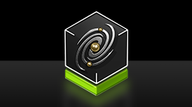
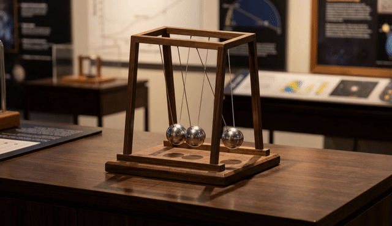
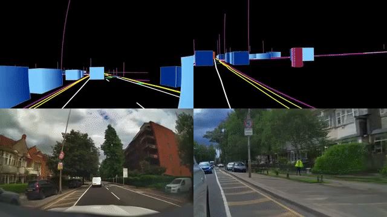
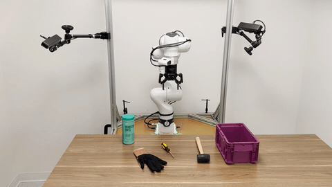
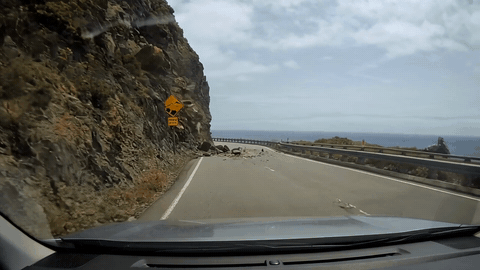
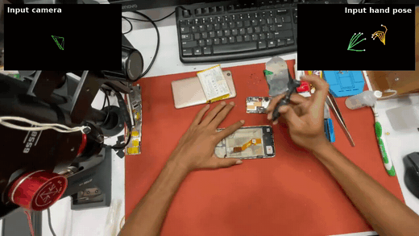
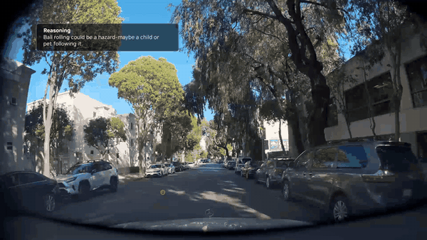

<!-- ============================================================
     HERO
     ============================================================ -->
<div align="center">



# NVIDIA Cosmos

### World Foundation Models for Physical AI

**One model family that sees, reasons, simulates, and acts.**

[](https://huggingface.co/collections/nvidia/cosmos3)
[](https://research.nvidia.com/labs/cosmos-lab/cosmos3/technical-report.pdf)
[](https://research.nvidia.com/labs/cosmos-lab/cosmos3/)
[](https://github.com/NVIDIA/cosmos/discussions)

[**Try it in your browser**](https://build.nvidia.com/nvidia/cosmos3-nano-reasoner) · [**Quickstart**](#generate-your-first-video) · [**Find your path**](#find-your-path) · [**Model Family**](#models)

</div>

<!-- ============================================================
     DEMO GRID — the model sells itself.
     Asset sources and re-cut specs: assets/ASSET_SPECS.md in the private repo (nvidia-cosmos/cosmos-private).
     ============================================================ -->
<table>
  <tr>
    <td align="center" width="33%">
      
      <sub><a href="cookbooks/cosmos3/generator/audiovisual/run_with_vllm_omni.ipynb"><b>Physics-aware generation</b></a><br>A Newton's cradle in motion: momentum transfer rendered with physical fidelity</sub>
    </td>
    <td align="center" width="33%">
      
      <sub><a href="cookbooks/cosmos3/generator/transfer/run_video_transfer_with_vllm_omni.ipynb"><b>Transfer</b></a><br>World-scenario control layout → photoreal driving video</sub>
    </td>
    <td align="center" width="33%">
      
      <sub><a href="cookbooks/cosmos3/generator/action/run_policy_with_vllm_omni.ipynb"><b>Action policy</b></a><br>Policy run: "put the screwdriver and the glove in the purple container"</sub>
    </td>
  </tr>
  <tr>
    <td align="center" width="33%">
      
      <sub><a href="cookbooks/cosmos3/generator/audiovisual/run_with_vllm_omni.ipynb"><b>Simulation</b></a><br>Generate synthetic data and create simulation for autonomous driving</sub>
    </td>
    <td align="center" width="33%">
      
      <sub><a href="cookbooks/cosmos3/generator/action/run_fd_with_vllm_omni.ipynb"><b>Action-conditioned World Model</b></a><br>Forward dynamics: egocentric rollout from input camera + hand pose</sub>
    </td>
    <td align="center" width="33%">
      
      <sub><a href="cookbooks/cosmos3/reasoner/run_with_vllm.ipynb"><b>World reasoning</b></a><br>Reason in complex real-world scenarios: a rolling ball means a child or pet may follow</sub>
    </td>
  </tr>
</table>

---

## What's new

- **[Jul 2026]** [Cosmos3-Edge](https://huggingface.co/nvidia/Cosmos3-Edge) released — the 4B tier for on-device, real-time deployment (Jetson AGX Orin / Thor / RTX Pro 6000).
- **[May 2026]** Cosmos 3 released: [HF collection](https://huggingface.co/collections/nvidia/cosmos3) · [Technical Report](https://research.nvidia.com/labs/cosmos-lab/cosmos3/technical-report.pdf).

## What is Cosmos?

NVIDIA Cosmos is an open platform for building physical AI applications — robots, autonomous vehicles, and smart infrastructure — providing better data, better environment, better starting point, and better tooling for physical AI developers. **Cosmos 3**, the current model family, is a suite of omnimodal world models built on a unified Mixture-of-Transformers architecture ([technical report](https://research.nvidia.com/labs/cosmos-lab/cosmos3/technical-report.pdf)).

One model, two surfaces:

|  | Inputs | Outputs | Use it for |
|---|---|---|---|
| **Reasoner** | text, vision | text | world understanding, grounding, task planning, embodied reasoning |
| **Generator** | text, vision, sound, action | vision, sound, action | world simulation, future prediction, synthetic data, policy learning |

This repository is the home of the models: everything for exploring, running, and evaluating Cosmos. For model training (SFT, LoRA, RL, distillation etc.), go to [Cosmos Framework](https://github.com/NVIDIA/cosmos-framework). Use [Cosmos Curator](https://github.com/NVIDIA/cosmos-curator) for data curation, and [Cosmos Evaluator](https://github.com/NVIDIA/cosmos-evaluator) for model output evaluation.

## Find your path

<table>
  <tr><th align="left" width="46%">I want to…</th><th align="left" width="42%">Go to</th><th align="left">Time</th></tr>
  <tr><td><b>See it work</b> — zero install</td><td><a href="https://build.nvidia.com/nvidia/cosmos3-nano">Video generation</a>, <a href="https://build.nvidia.com/nvidia/cosmos3-nano-reasoner">visual reasoning</a></td><td>1 min</td></tr>
  <tr><td><b>Generate my first video</b></td><td><a href="#generate-your-first-video">Quickstart ↓</a></td><td>10 min</td></tr>
  <tr><td><b>Reason over images &amp; video</b></td><td><a href="cookbooks/cosmos3/reasoner/run_with_vllm.ipynb">Reasoner notebook</a></td><td>10 min</td></tr>
  <tr><td><b>Serve an OpenAI-compatible API</b></td><td><a href="cookbooks/cosmos3/README.md">Serving setup guide</a> — vLLM, vLLM-Omni, or NIM</td><td>30 min</td></tr>
  <tr><td><b>Post-train on my own data</b> — SFT, distillation, RL</td><td><a href="https://github.com/NVIDIA/cosmos-framework">Cosmos Framework</a>, then <a href="evaluation/">evaluate here</a></td><td>hours</td></tr>
  <tr><td><b>Explore runnable notebooks</b></td><td><a href="cookbooks/cosmos3/README.md">Cookbooks</a></td><td>browse</td></tr>
  <tr><td><b>Evaluate a model</b></td><td><a href="evaluation/">Evaluation suites</a> — PAIBench, Physics-IQ, VLMEvalKit</td><td>hours</td></tr>
  <tr><td><b>Check latency &amp; throughput</b></td><td><a href="inference_benchmarks.md">Benchmarks</a></td><td>browse</td></tr>
</table>

## Generate your first video

```bash
uv venv --python 3.13 --seed --managed-python && source .venv/bin/activate
uv pip install --torch-backend=auto \
  "diffusers @ git+https://github.com/huggingface/diffusers.git" \
  accelerate av cosmos_guardrail huggingface_hub imageio imageio-ffmpeg \
  torch torchvision transformers
uvx hf@latest auth login   # Cosmos 3 checkpoints require a Hugging Face token
```

```python
import torch
from diffusers import Cosmos3OmniPipeline
from diffusers.utils import export_to_video

pipe = Cosmos3OmniPipeline.from_pretrained(
    "nvidia/Cosmos3-Nano", torch_dtype=torch.bfloat16, device_map="cuda"
)
video = pipe(prompt="A mobile robot navigates a warehouse aisle and stops at a shelf.").video
export_to_video(video, "first_video.mp4", fps=24)
```

First run downloads the 16B checkpoint; diffusion steps are compute-heavy, so long step times are normal. Full options, image/sound modes, and every other backend: [audiovisual cookbooks](cookbooks/cosmos3/generator/audiovisual/) · setup issues: [environment setup guide](cookbooks/cosmos3/README.md).


## Models

**Cosmos 3 ships as three base models** — every deployment tier, one omnimodal architecture:

| Base model | Size | Runs on | Best for |
|---|---|---|---|
| [Cosmos3-Super](https://huggingface.co/nvidia/Cosmos3-Super) | 64B | H200 / B200 / GB200 | Highest quality; synthetic data generation; teacher for distillation |
| [Cosmos3-Nano](https://huggingface.co/nvidia/Cosmos3-Nano) | 16B | RTX Pro 6000 / H100 / B200 | Balanced speed and quality; strong base model to post-train |
| [Cosmos3-Edge](https://huggingface.co/nvidia/Cosmos3-Edge) | 4B | Jetson AGX Orin / Thor / RTX Pro 6000 | Edge deployment; real-time robot policy and visual reasoning |

**Example checkpoints** in the [cosmos3-examples](https://huggingface.co/collections/nvidia/cosmos3-examples) collection are post-trained variants of the base models. They demonstrate what [post-training with Cosmos Framework](https://github.com/NVIDIA/cosmos-framework) can specialize Cosmos for — they're capability demos, not part of the product line:

| Example checkpoint | Base | Demonstrates |
|---|---|---|
| [Cosmos3-Super-Text2Image](https://huggingface.co/nvidia/Cosmos3-Super-Text2Image) | Super | Elite quality text-to-image |
| [Cosmos3-Super-Text2Image-4Step](https://huggingface.co/nvidia/Cosmos3-Super-Text2Image-4Step) | Super | Elite quality text-to-image, 17-25x faster |
| [Cosmos3-Super-Image2Video](https://huggingface.co/nvidia/Cosmos3-Super-Image2Video) | Super | Elite quality image-to-video |
| [Cosmos3-Super-Image2Video-4Step](https://huggingface.co/nvidia/Cosmos3-Super-Image2Video-4Step) | Super | Elite quality image-to-video, 17-25x faster |
| [Cosmos3-Nano-Policy-DROID](https://huggingface.co/nvidia/Cosmos3-Nano-Policy-DROID) | Nano | Open SOTA DROID robot policy, runs on RTX Pro 6000 |
| [Cosmos3-Edge-Policy-DROID](https://huggingface.co/nvidia/Cosmos3-Edge-Policy-DROID) | Edge | DROID robot policy at edge-deployable scale |

Full I/O specs, generation settings, and supported action embodiments: [model reference](docs/reference/models.md).

## Repository map

```text
cosmos/
├── cookbooks/          # runnable notebooks for every capability (start here to explore)
│   └── cosmos3/        # generator (audiovisual · action · transfer) · reasoner + prompt guide
├── evaluation/         # quality benchmark suites: PAIBench, Physics-IQ, RBench, UniGenBench, VLMEvalKit
├── docs/
│   └── reference/      # lookup: model reference
├── assets/             # brand + demo media
└── README.md           # you are here
```

Training, optimization, and deployment tooling lives in [Cosmos Framework](https://github.com/NVIDIA/cosmos-framework).

## Platform

| Project | Purpose |
|---|---|
| **Cosmos** | This repo |
| [Cosmos Framework](https://github.com/NVIDIA/cosmos-framework) | Train, optimize, and deploy physical AI models — SFT · LoRA · distillation · RL post-training, for Cosmos and beyond |
| [Cosmos Curator](https://github.com/NVIDIA/cosmos-curator) | Distributed data curation: processing, annotation, filtering, dedup |
| [Cosmos Evaluator](https://github.com/NVIDIA/cosmos-evaluator) | Automated evaluation system for world generation & reasoning outputs |

Cosmos 3 runs on Diffusers, Transformers, vLLM, vLLM-Omni, SGLang, TensorRT-LLM, and NIM — pick a backend in the [environment setup guide](cookbooks/cosmos3/README.md).

## Community & contributing

Questions and ideas → [Discussions](https://github.com/NVIDIA/cosmos/discussions). Bugs → [Issues](https://github.com/NVIDIA/cosmos/issues). Code → [CONTRIBUTING.md](CONTRIBUTING.md).

## Limitations & safety

Cosmos 3 can produce artifacts in long, high-resolution, or physically complex outputs (temporal inconsistency, object morphing, implausible dynamics). Safety-critical applications need additional validation and system-level safety analysis. Generation ships with [guardrails](cookbooks/cosmos3/README.md) on by default.

## Citation & license

```bibtex
@techreport{nvidia2026cosmos3,
  title  = {Cosmos 3: Omnimodal World Models for physical AI},
  author = {{NVIDIA Cosmos Team}},
  year   = {2026},
  url    = {https://research.nvidia.com/labs/cosmos-lab/cosmos3/technical-report.pdf}
}
```

Source code and models are released under [OpenMDW-1.1](https://openmdw.ai/license/1-1/). Custom licensing: <cosmos-license@nvidia.com>. This project may download third-party open source software; review those licenses before use.
